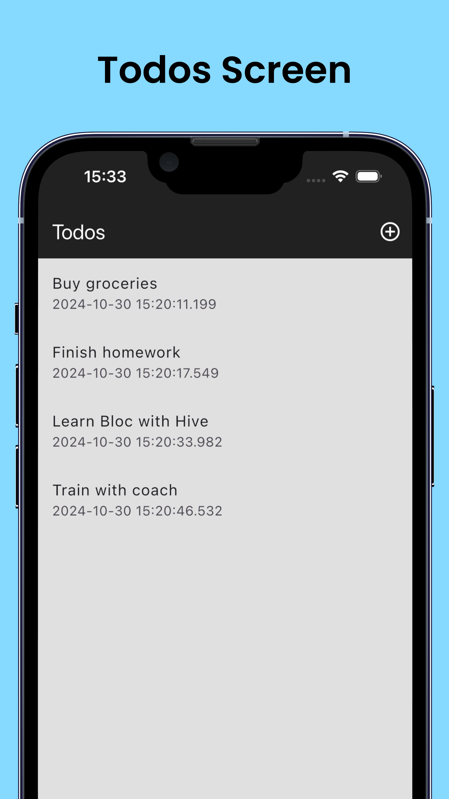
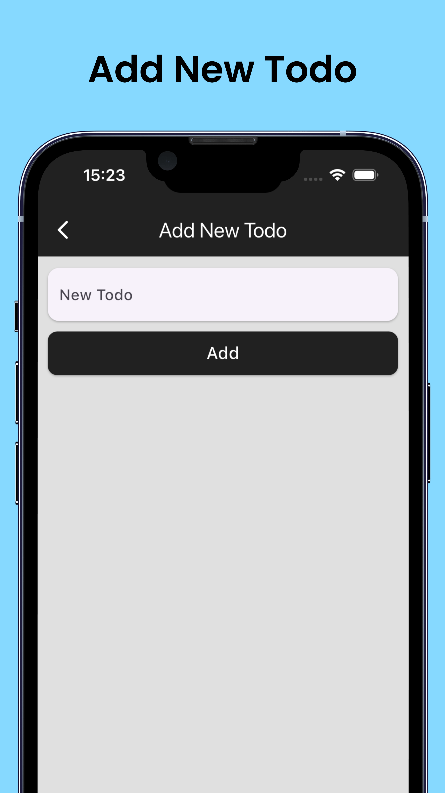
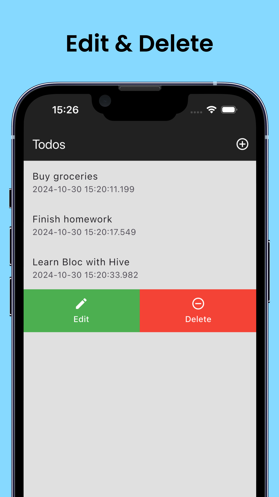
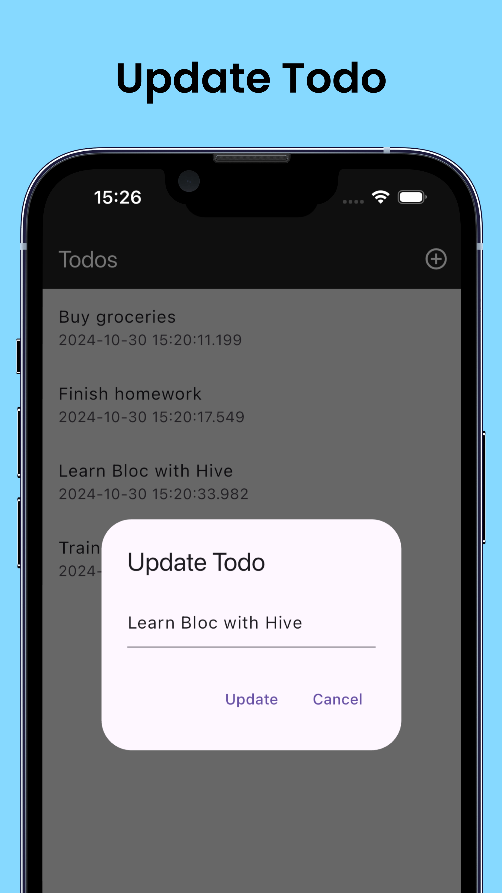

# Todo App

A simple Todo application built with Flutter, using the Cubit state management package and Hive for local data persistence.

## Features

- Add, update, and delete todos
- Persistent storage with Hive database
- State management with Cubit (from flutter_bloc package)
- Editable todos with sliding actions

## Screenshots







## Getting Started

## Dependencies

This project relies on the following packages:

1. **flutter_bloc** - [Link to flutter_bloc](https://pub.dev/packages/flutter_bloc)  
   Used for managing the application state with Cubit.

2. **hive_flutter** - [Link to hive_flutter](https://pub.dev/packages/hive_flutter)  
   Hive provides a lightweight and efficient database solution for Flutter apps, with `hive_flutter` handling initialization and usage in Flutter.

3. **hive** - [Link to hive](https://pub.dev/packages/hive)  
   A lightweight, NoSQL database solution for Flutter, used for persistent storage of todo items.

4. **hive_generator** - [Link to hive_generator](https://pub.dev/packages/hive_generator)  
   Generates TypeAdapters to allow storing custom objects (like `Todo`) in Hive.

5. **build_runner** - [Link to build_runner](https://pub.dev/packages/build_runner)  
   Runs code-generation scripts for packages like `hive_generator` to automate tasks like creating adapters for Hive.

6. **flutter_slidable** - [Link to flutter_slidable](https://pub.dev/packages/flutter_slidable)  
   Allows swipe actions on each todo item for editing and deleting.

### Additional Setup

1. To generate the necessary files for Hive (such as TypeAdapters), run:
   ```bash
   flutter pub run build_runner build


### Prerequisites

- Flutter SDK (>= 3.0.0)
- Dart (>= 2.17.0)

### Installation

1. **Clone the repo**
   ```bash
   git clone https://github.com/your-username/todo_app.git

